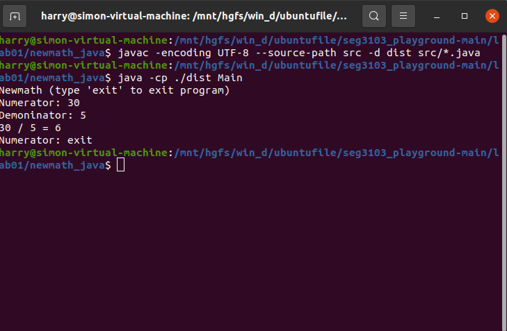
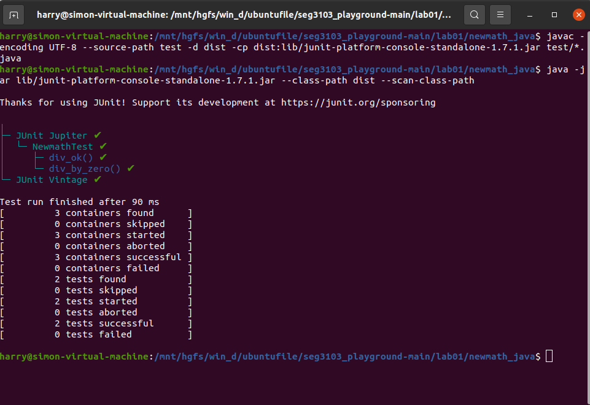
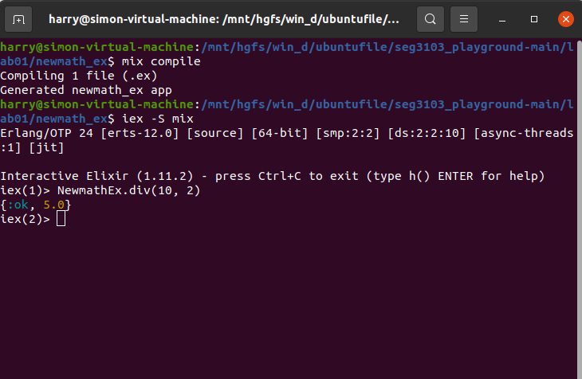
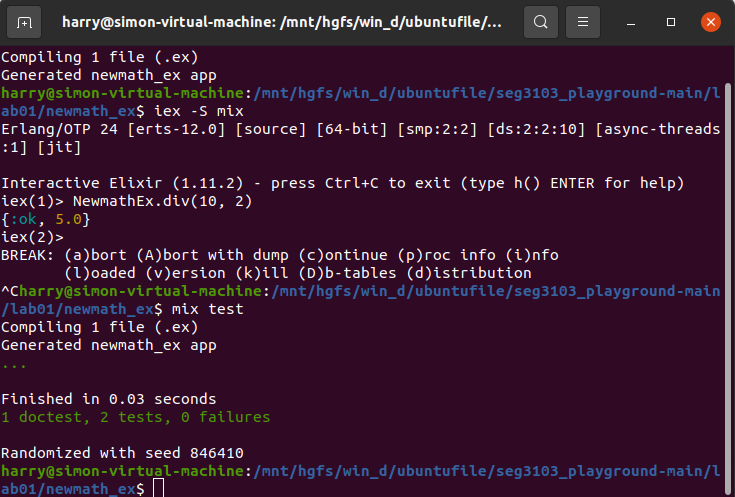

Haochu Chen
300067058

To run the Java program (in `newmath_java`), first I compile it

```bash
javac -encoding UTF-8 --source-path src -d dist src/*.java
```

Then I run it

```bash
java -cp ./dist Main
```

Here is an output of the running program




### JUnit

I am working with JUnit 5 (via Console standalone 1.7.1)

To run JUnit, I need to compile the application (see above), and then compile the test code

```bash
javac -encoding UTF-8 --source-path test -d dist -cp dist:lib/junit-platform-console-standalone-1.7.1.jar test/*.java
```

Then I run the tests using

```
java -jar lib/junit-platform-console-standalone-1.7.1.jar --class-path dist --scan-class-path
```

Here is the output of the tests




### Elixir

I am running Elixir 11.4 with Erlang 23

```bash
$ elixir --version
Erlang/OTP 23 [erts-11.1.7] [source] [64-bit] [smp:8:8] [ds:8:8:10] [async-threads:1] [dtrace]

Elixir 1.11.4 (compiled with Erlang/OTP 23)
```

To run the Elixir program (in `newmath_ex`), first I compile it

```bash
mix compile
```

Then I run it

```bash
iex -S mix
```

Here is an output of the running program



### ExUnit

ExUnit is built directly into Elixir (and compiled like above with `mix compile`)

To run the tests

```
mix test
```

Here is the output of the tests



