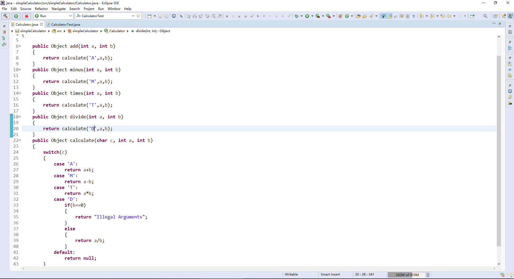
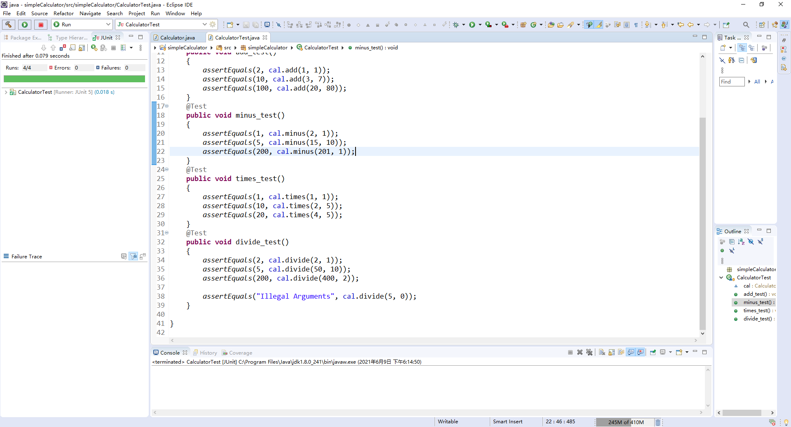

Haochu Chen
300067058

I wrote a simple integer calculator

First, a failing test:

Then, I made it pass:

After that, I add more test cases (minus, times, and divide) and failed:

Then made them pass:

I added a divide by 0 test case and failed:

Then made it pass:

This is the codes now:

Then I did some refactoring, added a calculate method and put all calculations into it:

And the tests still pass:

===============================================================================

Here are the screenshots that I compiled and ran tests of the elixir tic and fizzbuzz:

