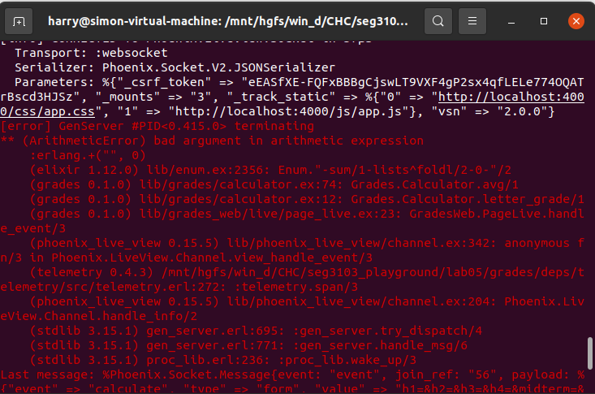

Haochu Chen
300067058

Images of stubbed code

Results from putting in my working code from assignment #2

This is because what we return in assignment 2 is decimals, like 0.9, and what this application need is percentage, like 80. 
The data types of the front end and the back end are different.
