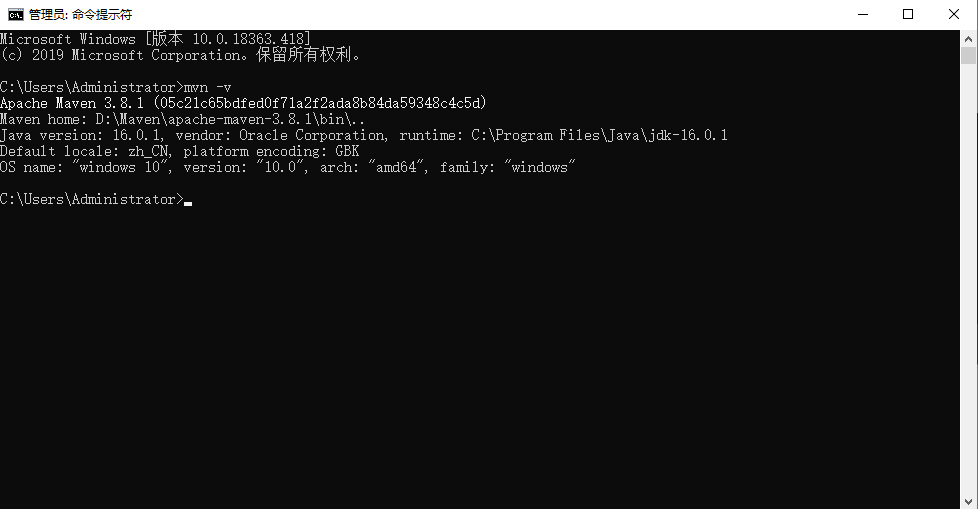
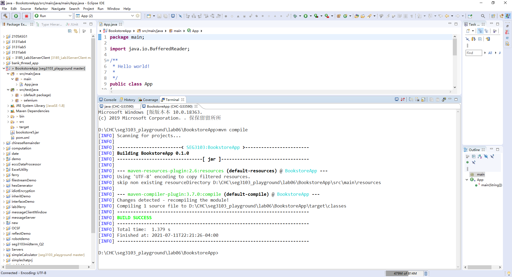
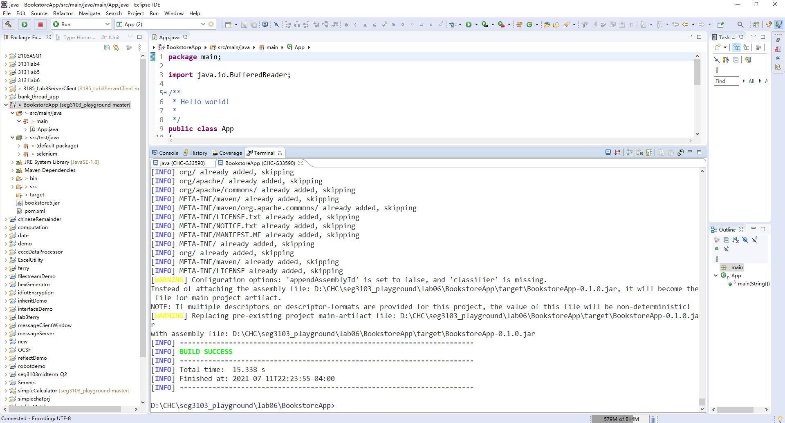
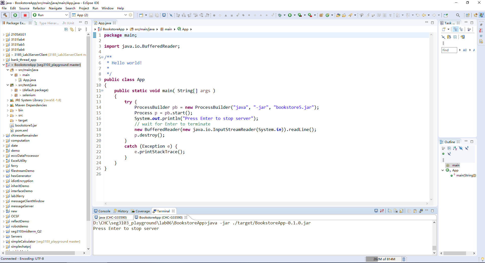
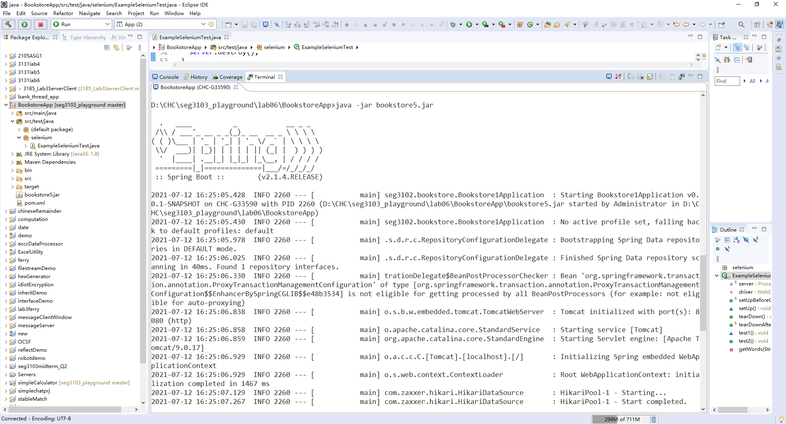
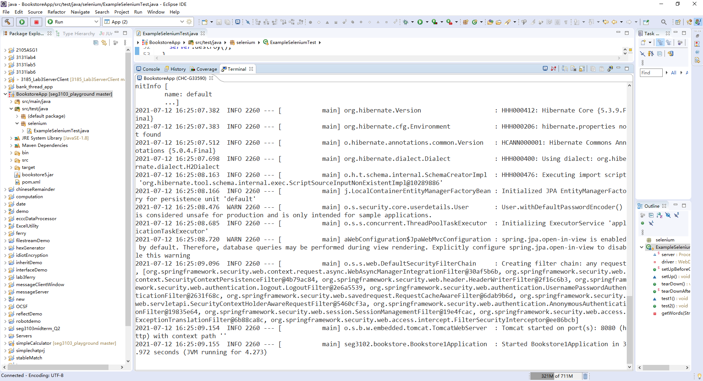
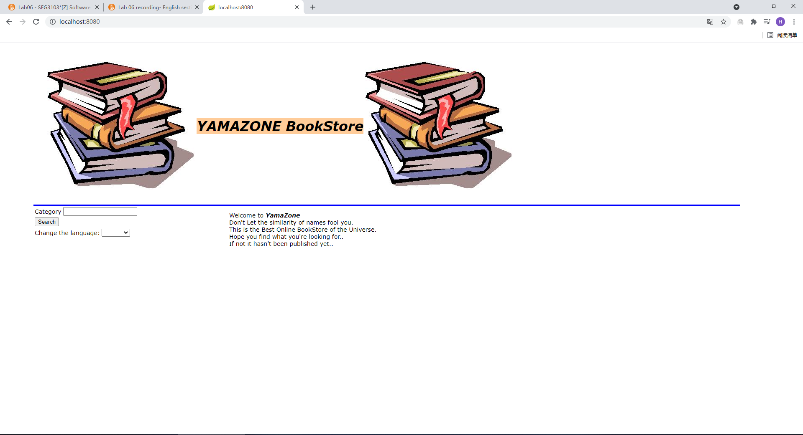
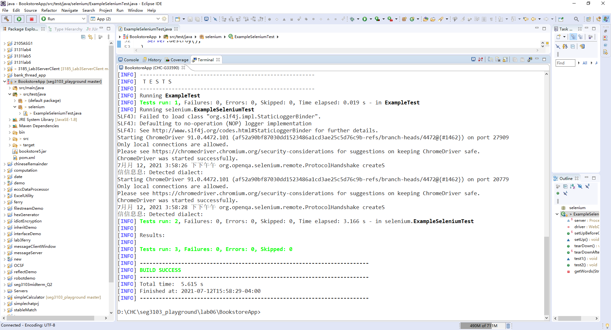
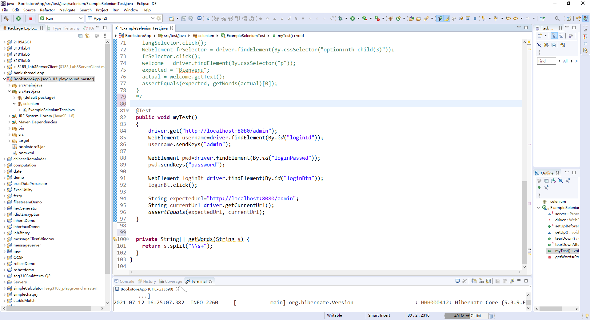
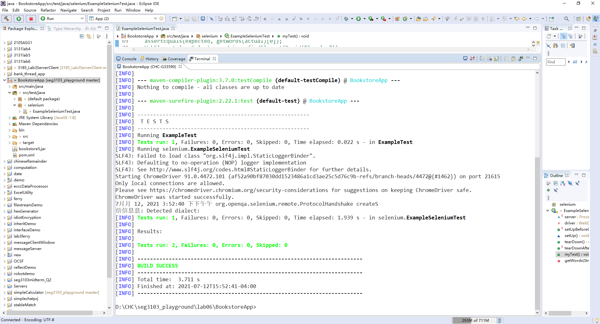

Haochu Chen
300067058

Output of "mvn -v"

Output of "mvn compile"

Output of "mvn package -DskipTests" \n
It packages all project files into one jar file, so that we can easily run it.

Output of "java -jar ./target/BookstoreApp-0.1.0.jar"

But it didn't work in the browser, So I changed it into "java -jar bookstore5.jar" according to the arguments in the code.

Then it works in the browser

Output of "mvn test"

Screenshot of at least one additional selenium web driver test

Output of "mvn test" for the new test

