Haochu Chen
300067058

Application:
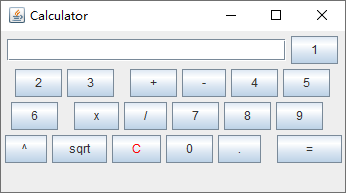

Code changed is in /calculator

Analysis:  
&NewLine;
&NewLine;
&NewLine;
&NewLine;
&NewLine;
 
 
 
 
 
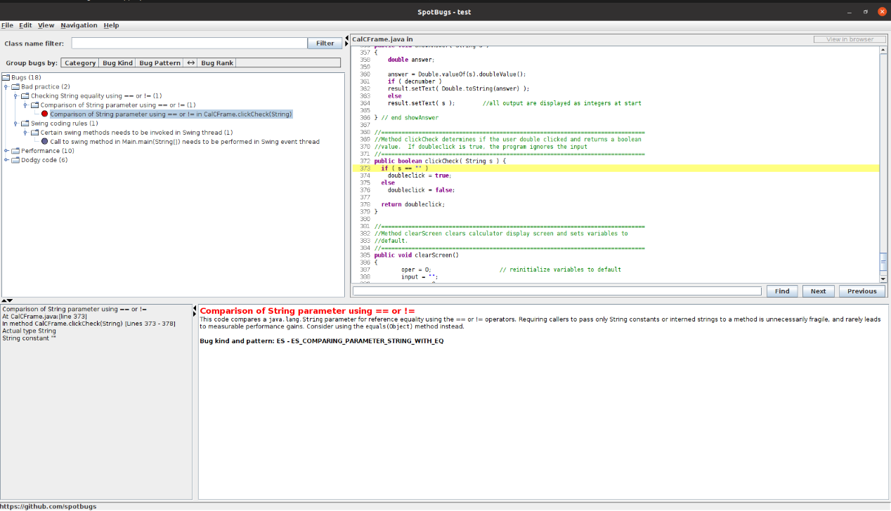
“==” cannot be used to compare two strings, “==” is used to compare the memory address of two strings, “equals()” should be used here.
  
  
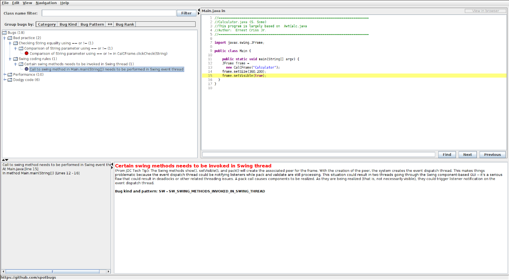
“setVisible()” will cause the events dispatching on components in muti-threads of JFrame. These threads are asynchronized, so it may cause some problems, like deadlock. So I put it into a swing thread.

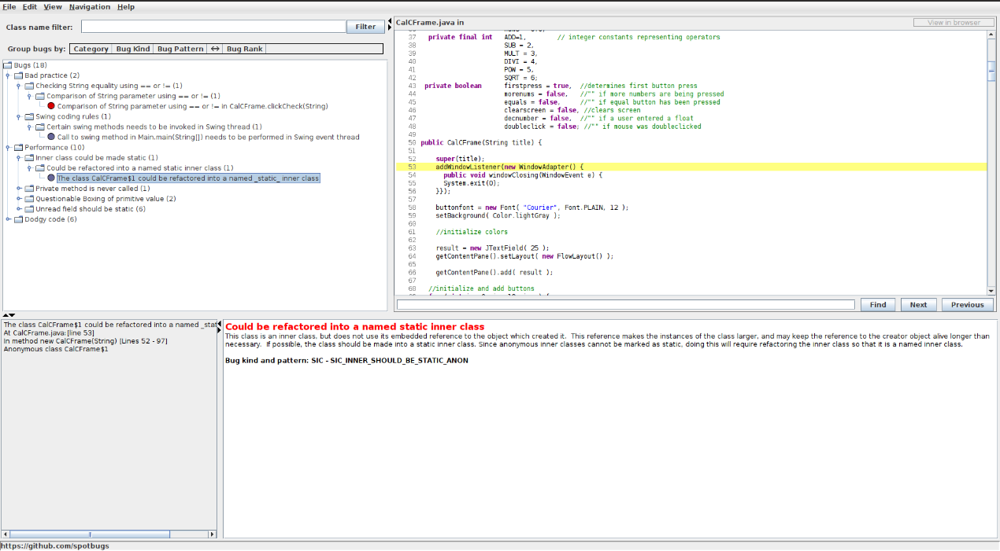
This inner class is anonymous and not static, so it cannot be accessed outside and static methods. So I declared it as a static named class.

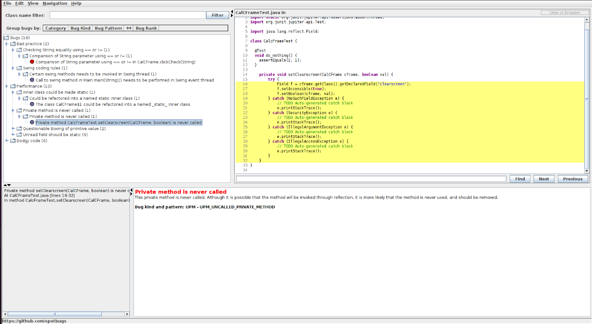
This method is never been used, so I commented it.

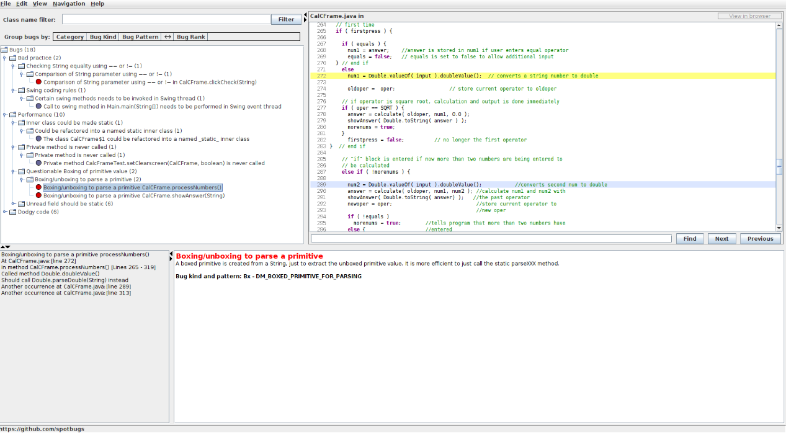
It takes two steps to get a double type, which is not efficient, so I used “Double.parseDouble()” instead.

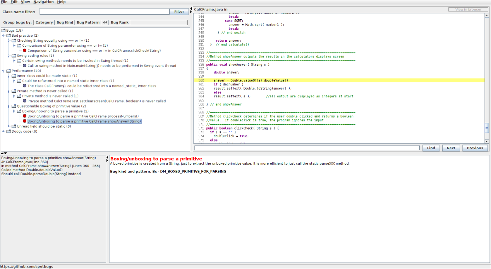
Same as above.

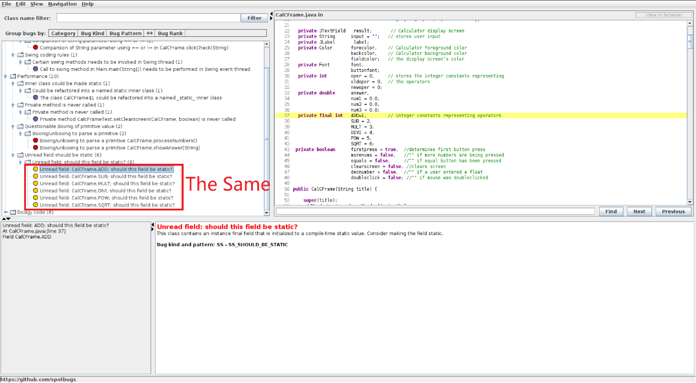
These final fields are initialized as they were declared. It is better to make them static final.

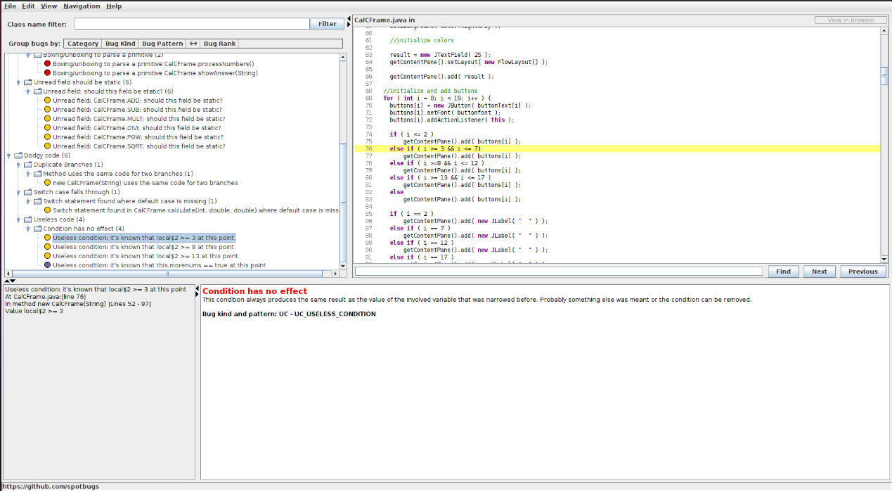
If a variable is not <= 2, than it must be >=3, so “i>=3” is useless, so I removed it, same as the “i>=8” and “i>=13”.

These if else statements covered all situations of I from 0 to 18, which is all situations I can be in the loop, and they do the same things for all if else statements. So I commented them all and coded “getContentPane().add(buttons[i]);” only once.

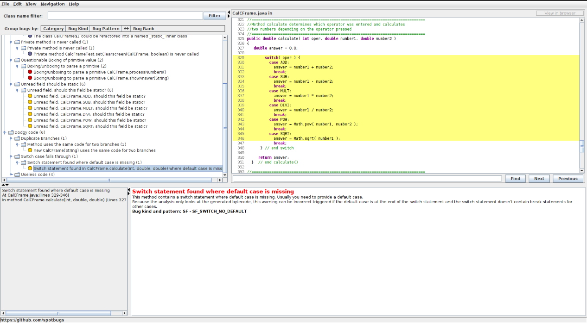
This switch case statement has no default block, I added it.

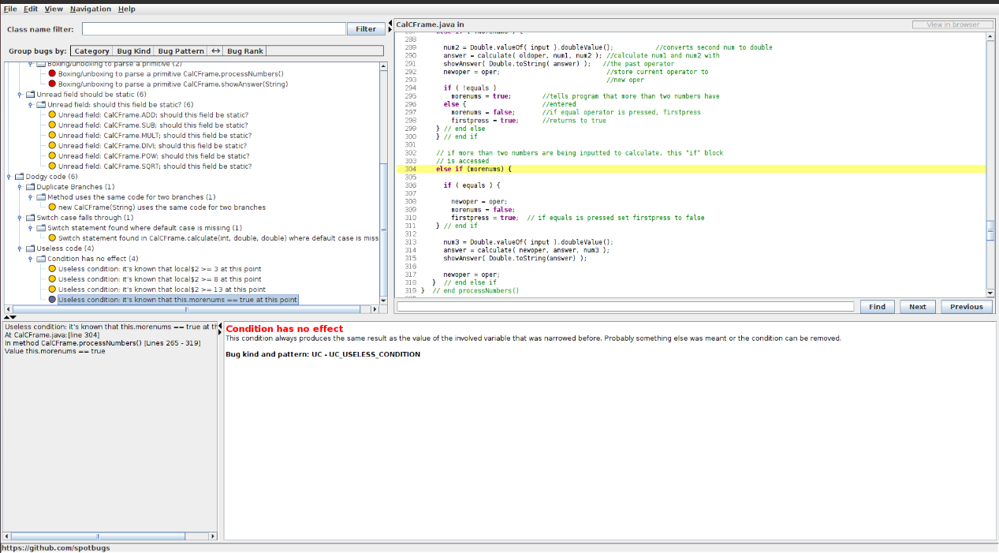
If “!morenums” is true, than there is no need to judge the “morenums” again. So I used a single “else” instead of “else if (morenums)”.
